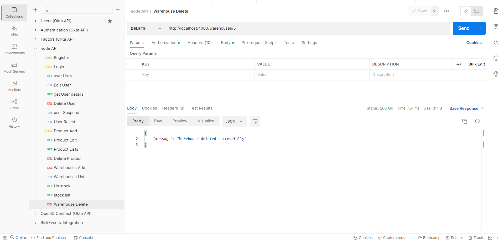

# Back end Api developed by node js

## Installation setup

### 1.Install Node.js and npm from https://nodejs.org/en/download/.
### 2.Install MySQL Community Server from https://dev.mysql.com/downloads/mysql/ and ensure it is started. Installation   instructions are available at https://dev.mysql.com/doc/refman/8.0/en/installing.html.
### 3.Download or clone the project source code from `https://github.com/mahendrancse88/regovtech-back-end-take-home.git`

## Run the project

NPM
```sh
npm install
npm start
```
## Demo

1.Add product

2.Add warehouse 

3.Stock

4.Un Stock

5. List product

6. List warehouses

7. Delete product

8. Delete Warehouse
